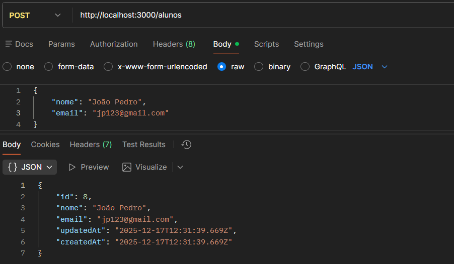
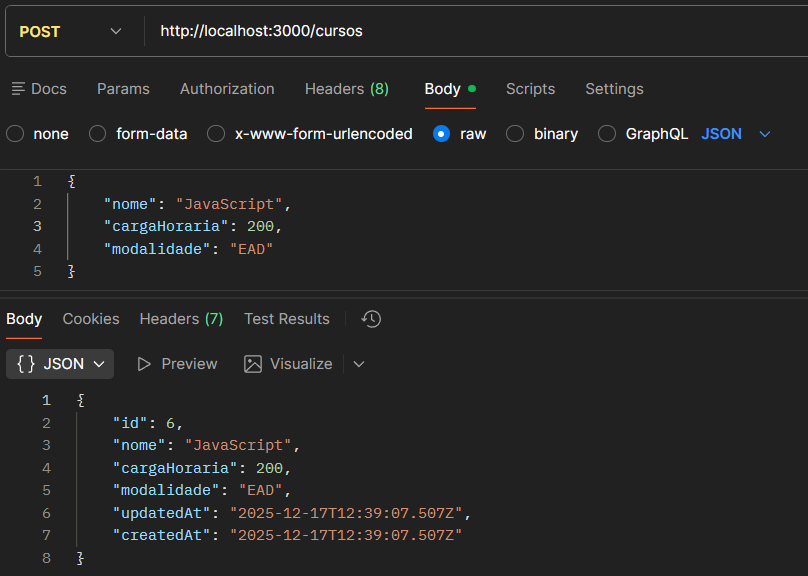
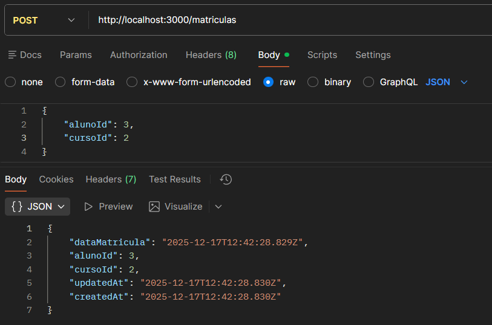
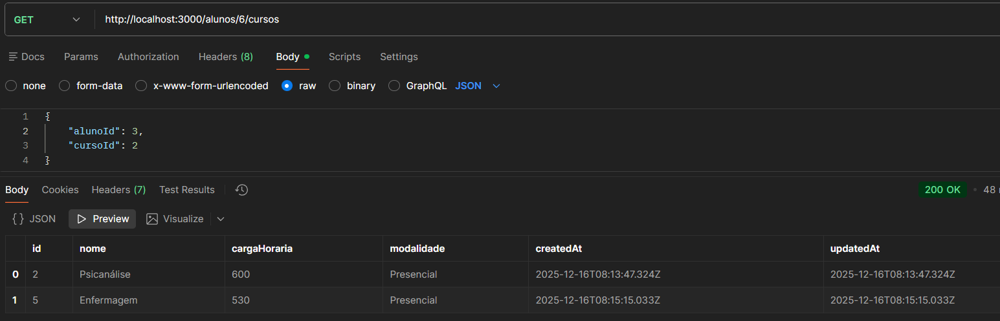
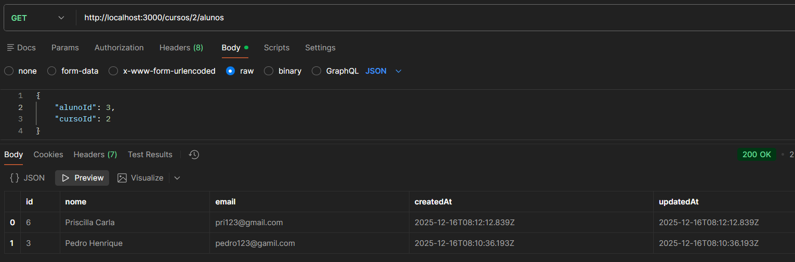

# Projeto-API
### API REST para gerenciar alunos, cursos e matrículas usando Node.js, Express e Sequelize.

## Como instalar as dependências: 
1. ***Instale o Node.js***
   > https://nodejs.org

2. ***No terminal:***
   > `node -v` --para verificar se instalou

3. Clone o repositório
   > ***No terminal*** > `git clone https://github.com/JhuliaEduarda/Projeto-API`
   
4. ***No terminal:***
   > `npm install`
Esse comando instala:
***express*** → framework da API
***sequelize*** → ORM para banco de dados
***sqlite3*** → banco de dados
***sequelize-cli*** → ferramenta para migrations
   
   > `npm -v` --verifica se instalou 

## Como iniciar a aplicação:
1. ***No terminal:***
   > `node src/server.js`

## Principais Endpoints no Postman 🟧
   > ***Criação de Aluno***
>  
   > ***Criação de Curso***
>  
   > ***Criação de Matrícula***
> 
   > ***Consultar Cursos de um Aluno***
> 
   > ***Consultar Alunos de um Curso***
> 

 

